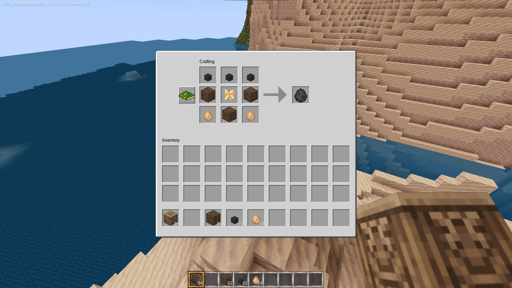
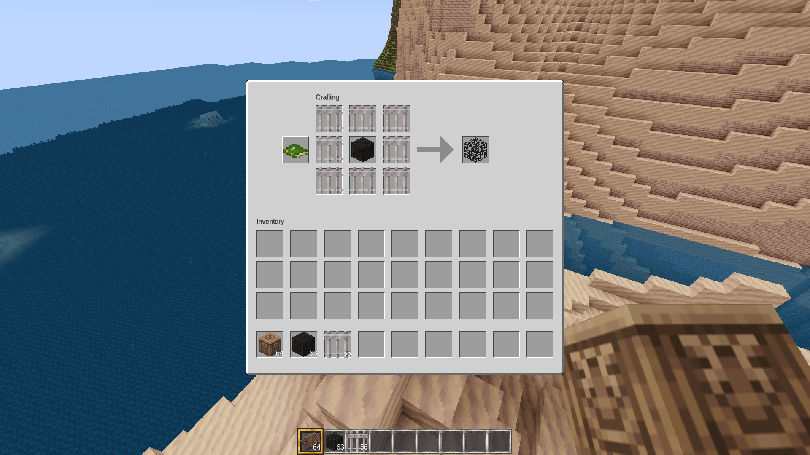

# SpawnCraft
A mod for MineClone that allows players to craft spawners and spawn eggs.

I think the recipes are reasonably fair (most of them require Ancient Debris or Netherite), and they can be individually toggled off in the Settings menu.

The recipes appear in the crafting guide, so I'm not going to include a full list here. I recommend turning off "learn crafting recipes progressively" in the settings menu to make it easier to figure out what you need to craft certain eggs.

